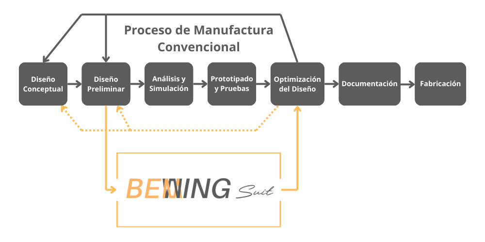
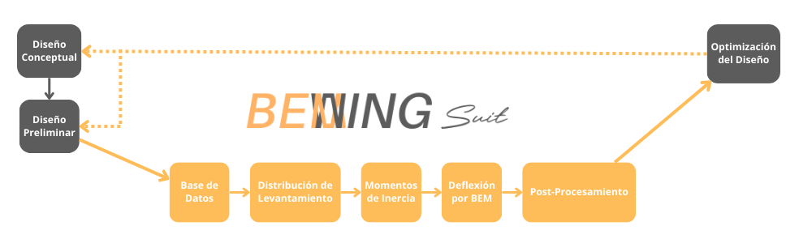

  <picture>
    <source media="(prefers-color-scheme: dark)" srcset="./documentation_images/ACRONIM.png">
    
  </picture>

# Bewing-Suit
 Python based desktop suit for wing structural analysis based on BEM

 Intended use:

  <picture>
    <source media="(prefers-color-scheme: dark)" srcset="./documentation_images/BEWING_CONCEPT_2.png">
    
  </picture>

Internal structure:

  <picture>
    <source media="(prefers-color-scheme: dark)" srcset="./documentation_images/BEWING_FUNCTION.png">
    
  </picture>

