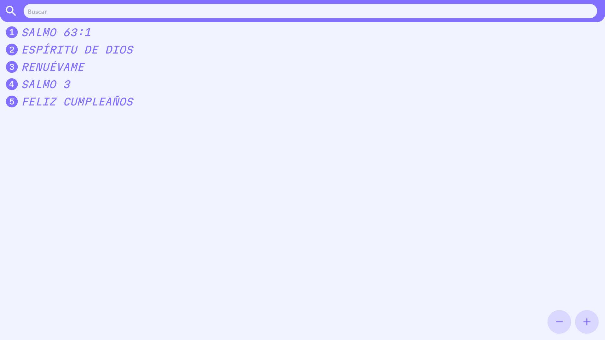

  <picture>
    <source media="(prefers-color-scheme: dark)" srcset="./documentation_images/coritario_icon.png">
    
  </picture>

# Coritario Bautista
 Cancionero bautista multiplataforma programado en Dart y distribuido mediante Flutter

 Libreria:

  <picture>
    <source media="(prefers-color-scheme: dark)" srcset="./documentation_images/1.png">
    
  </picture>

Letras:

  <picture>
    <source media="(prefers-color-scheme: dark)" srcset="./documentation_images/2.png">
    
  </picture>

Acordes / Modo Enfoque:

  <picture>
    <source media="(prefers-color-scheme: dark)" srcset="./documentation_images/3.png">
    
  </picture>

**Nota:** *En Windows* utilice **F11** para entrar y salir del modo pantalla completa.
